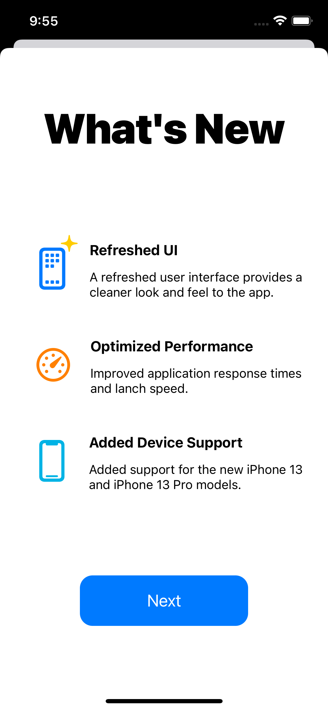
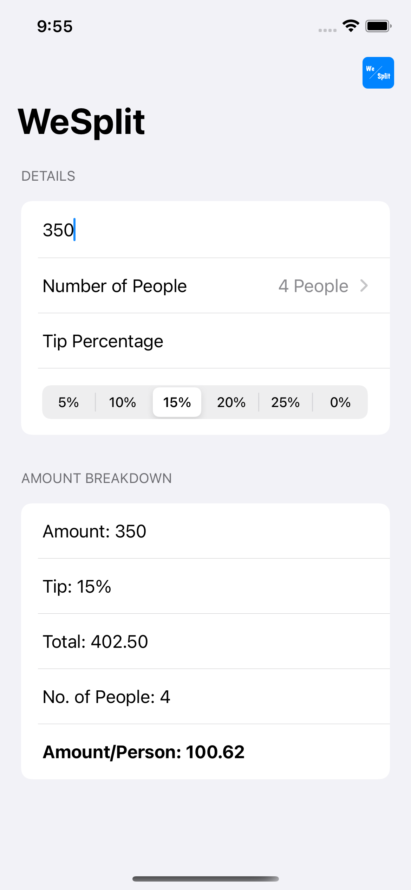
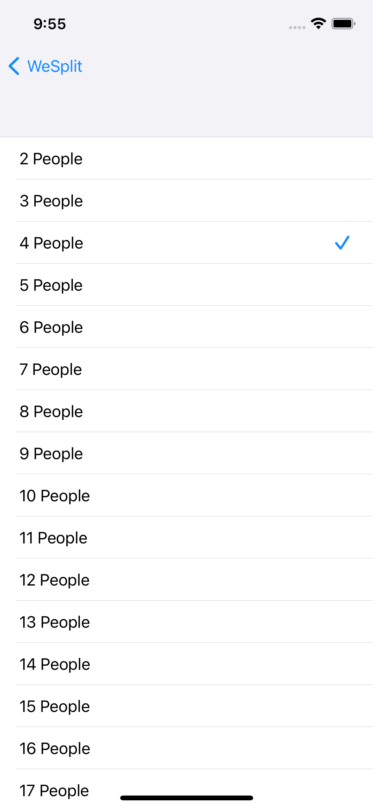
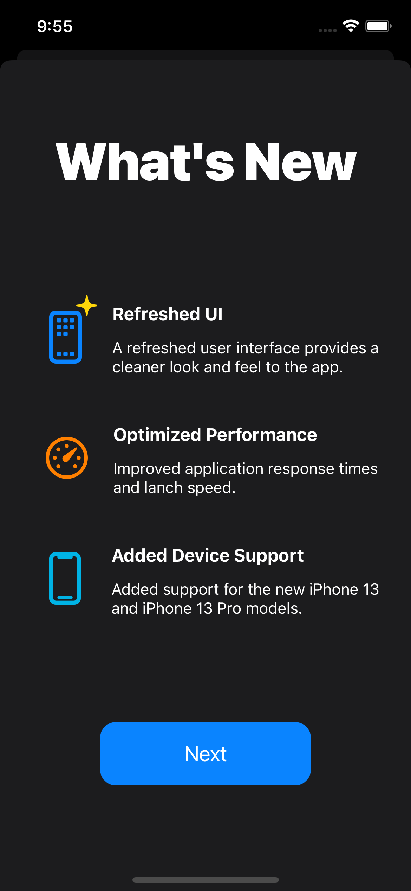
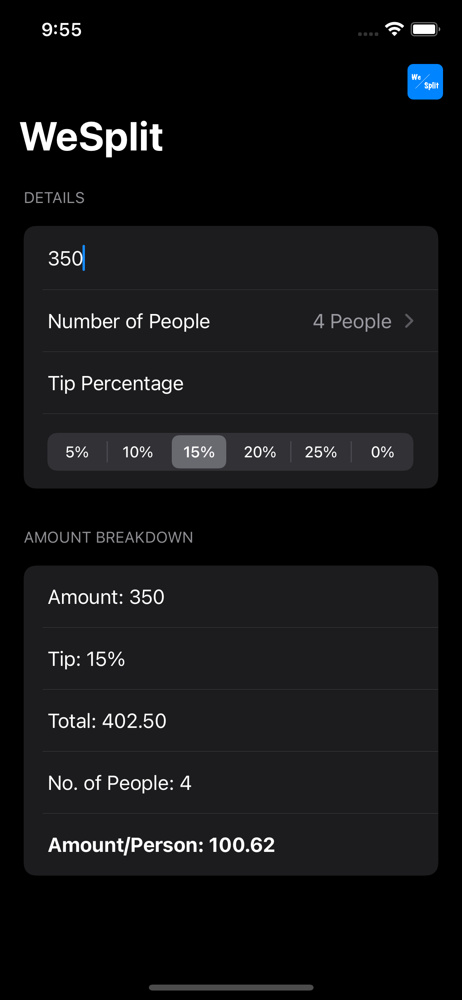
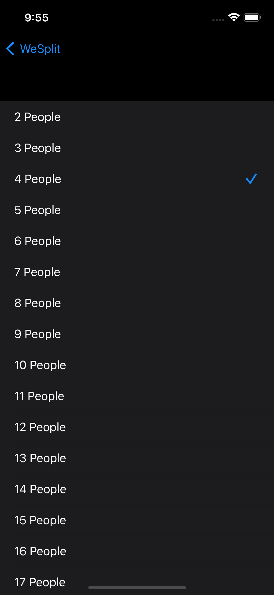

<html>
  <head>
    <link href="https://cdn.jsdelivr.net/npm/bootstrap@5.1.1/dist/css/bootstrap.min.css" rel="stylesheet" integrity="sha384-F3w7mX95PdgyTmZZMECAngseQB83DfGTowi0iMjiWaeVhAn4FJkqJByhZMI3AhiU" crossorigin="anonymous">
  </head>
  
  <body>
    <h1>WeSplit</h1>

 WeSplit is an iOS application which is used to split the cost of a restaurant bill among a group of people. 

<table class="table">
  <thead>
  <tr>
    <th>
      
    </th>
    <th>
      
    </th>
  </tr>
  </thead>
  <tbody>
  <tr>
    <td>
Splash Screen Light
</td>
    <td>
Splash Screen Dark
</td>
  </tr>
  </tbody>
</table>

    
## Features:
<ul>
  <li>Split a bill among a group of people.</li>
  <li>Select the number of people to split the bill among.</li>
  <li>Select a tip percentage that you would like to include.</li>
  <li>View complete breakdown of amount and tip.</li>
  </ul>
    
## Gallery:
<table class="table">
  <thead>
  <tr>
    <th>
      
    </th>
    <th>
      
    </th>
    <th>
      
    </th>
  </tr>
  </thead>
  <tbody>
  <tr>
    <td>
OnBoarding Screen
</td>
    <td>
Main Screen
</td>
    <td>
People Selection Screen
</td>
  </tr>
  </tbody>
  <thead>
  <tr>
    <th>
      
    </th>
    <th>
      
    </th>
    <th>
      
    </th>
  </tr>
  </thead>
  <tbody>
  <tr>
    <td>
OnBoarding Screen (Dark Mode)
</td>
    <td>
Main Screen (Dark Mode)
</td>
    <td>
People Selection Screen (Dark Mode)
</td>
  </tr>
  </tbody>
</table>
    
## Video Walkthrough:
    
<!-- <video controls>
<source src="Resources/Video-Showcase-Light.mp4" type="video/mp4">
  Your browser does not support videos.
</video>
    
<ul>
<li>https://www.youtube.com/watch?v=yx8yns_SDpc</li>
</ul>
    

 -->
https://user-images.githubusercontent.com/53140446/133642260-4412f2a4-7d86-4ba7-aa4d-3ba213401b2f.mp4

https://user-images.githubusercontent.com/53140446/133642376-6cf9b5dd-c281-4827-8b78-14c8856757fb.mp4

  </body>
</html>
